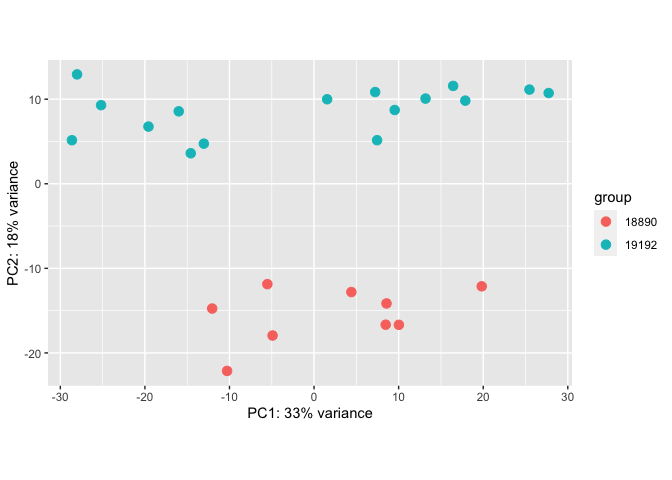
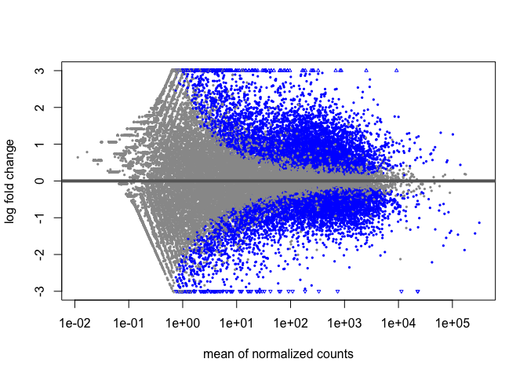

aortopathy
================
John Chamberlin
10/19/2022

``` r
library(dplyr)
library(tidyr)
library(tidyverse)
library(tximport)
library(DESeq2)
```

``` r
# import the metadata
m1 = readxl::read_xlsx("data/MetadataSamples_QuinlanLab_5.27.xlsx")
m2 = readxl::read_xlsx("data/Glotzbach Sample Match List 05312022.xlsx")

# we care about the GLO ID, ID and the phenotype
m1 = m1[complete.cases(m1),] # drop empty row
m2 = m2 %>% select_if(function(x) !(all(is.na(x))))
m2 = m2 %>% filter(!is.na(Organism))

colnames(m1) = make.names(colnames(m1),unique=TRUE)
colnames(m2) = make.names(colnames(m2),unique=TRUE)

metada = m1 %>% left_join(m2, by = c("Glotzbach.Lab.ID" = "Sample.Name"))
```

``` r
ifiles = list.files("data/rsem/",
                    pattern = "*.isoforms.results")
gfiles = list.files("data/rsem/",
                    pattern = "*.genes.results")

files = paste0("data/rsem/",ifiles)
names(files) = gsub("[:_:].*$","",ifiles)

tx2gene = data.table::fread("data/rsem/18890X1_210521_A00421_0326_BH3HT3DSX2_S1_L001.isoforms.results") %>% select(transcript_id, gene_id)

txi.rsem = tximport(files,type = "rsem", 
                    tx2gene = tx2gene)
```

    ## reading in files with read_tsv

    ## 1 2 3 4 5 6 7 8 9 10 11 12 13 14 15 16 17 18 19 20 21 22 23 24 25 
    ## summarizing abundance
    ## summarizing counts
    ## summarizing length

``` r
sampleTable = data.frame("batch"=gsub("X.*$","",colnames(txi.rsem$counts)))
rownames(sampleTable) = colnames(txi.rsem$counts)

dds <- DESeq2::DESeqDataSetFromTximport(txi.rsem, sampleTable, ~batch)
```

    ## Warning in DESeqDataSet(se, design = design, ignoreRank): some variables in
    ## design formula are characters, converting to factors

    ## using counts and average transcript lengths from tximport

``` r
vsd <- vst(dds, blind=FALSE)
```

    ## using 'avgTxLength' from assays(dds), correcting for library size

``` r
plotPCA(vsd, intgroup = "batch")
```

<!-- -->

``` r
# toy example of differential expression between batches, not phenotype
dds = DESeq(dds)
```

    ## estimating size factors

    ## using 'avgTxLength' from assays(dds), correcting for library size

    ## estimating dispersions

    ## gene-wise dispersion estimates

    ## mean-dispersion relationship

    ## final dispersion estimates

    ## fitting model and testing

    ## -- replacing outliers and refitting for 458 genes
    ## -- DESeq argument 'minReplicatesForReplace' = 7 
    ## -- original counts are preserved in counts(dds)

    ## estimating dispersions

    ## fitting model and testing

``` r
res = results(dds)
res
```

    ## log2 fold change (MLE): batch 19192 vs 18890 
    ## Wald test p-value: batch 19192 vs 18890 
    ## DataFrame with 60664 rows and 6 columns
    ##                    baseMean log2FoldChange     lfcSE       stat      pvalue
    ##                   <numeric>      <numeric> <numeric>  <numeric>   <numeric>
    ## ENSG00000000003    134.1600      0.5161879 0.1792438   2.879809 3.97916e-03
    ## ENSG00000000005     11.4353      1.3906709 1.6798169   0.827870 4.07744e-01
    ## ENSG00000000419    395.7892     -1.0085819 0.0944267 -10.681114 1.24765e-26
    ## ENSG00000000457    210.8617      0.0703597 0.1004840   0.700207 4.83798e-01
    ## ENSG00000000460     76.8214     -0.3251698 0.1935670  -1.679882 9.29802e-02
    ## ...                     ...            ...       ...        ...         ...
    ## ENSG00000288721  20.3835160       1.030731  0.335484   3.072372 2.12365e-03
    ## ENSG00000288722 300.4529643      -0.490747  0.289480  -1.695272 9.00238e-02
    ## ENSG00000288723   0.0531436       1.059805  3.123483   0.339302 7.34382e-01
    ## ENSG00000288724   0.0000000             NA        NA         NA          NA
    ## ENSG00000288725  91.8659734      -5.431470  1.318161  -4.120490 3.78068e-05
    ##                        padj
    ##                   <numeric>
    ## ENSG00000000003 1.35378e-02
    ## ENSG00000000005 5.72933e-01
    ## ENSG00000000419 6.45287e-25
    ## ENSG00000000457 6.42981e-01
    ## ENSG00000000460 1.91408e-01
    ## ...                     ...
    ## ENSG00000288721 0.007775382
    ## ENSG00000288722 0.186494804
    ## ENSG00000288723          NA
    ## ENSG00000288724          NA
    ## ENSG00000288725 0.000204751

``` r
plotMA(res, ylim = c(-3,3))
```

<!-- -->
